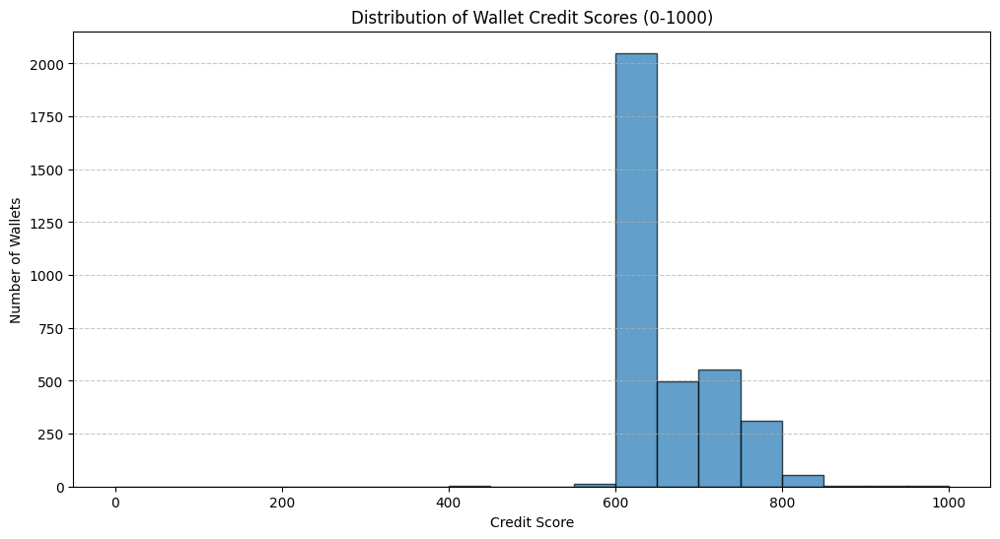

# 📊 Analysis of Aave V2 Wallet Scores

This document presents an analysis of credit scores assigned to wallets interacting with the Aave V2 protocol. The credit scoring model evaluates wallet behavior based on historical transaction data, with the goal of identifying responsible users and flagging potential risks.

---

## ✅ Dataset Overview

- **Source**: 100,000 on-chain transactions involving Aave V2  
- **Output**: Credit scores for 3,497 unique wallets  
- **Score Range**: 0 (high risk) to 1000 (low risk, reliable)

---

## 📈 Score Distribution

The credit scores follow a skewed normal distribution, with most wallets clustered in the **600–800** range.

### Key Observations:

- **Most Wallets Score 600–800**: Indicates a generally responsible and moderately active user base.
- **Peak at 600–650**: Suggests a large population of “average” users.
- **Few Wallets Below 500**: Risky behavior (e.g., liquidation, missed repayments) is uncommon.
- **Wallets Scoring 800+**: Represent the most reliable and capital-efficient users on Aave V2.

---

## 🏆 High-Scoring Wallets (Score: 850–1000)

These are the most trustworthy wallets on the protocol.

**Typical Characteristics**:
- ✅ Zero Liquidations  
- ✅ Repayment Ratio ≈ 1.0 or 5.0 (fully repaid or over-collateralized)  
- ✅ High Transaction Count (sustained engagement)  
- ✅ Long Lifespan (months or years)  
- ✅ Significant Deposits  

**Conclusion**: Ideal users — low risk, high value, consistent activity.

---

## ⚖️ Mid-Scoring Wallets (Score: 600–850)

This is the largest segment in the dataset, representing everyday users.

**Typical Characteristics**:
- 🚫 No Liquidations  
- ⚠️ Mixed Repayment Ratio (mostly responsible)  
- 📅 Varied Lifespan (new and long-term users)  
- 🔁 Moderate Activity  

**Conclusion**: Generally reliable users with moderate activity. Not risky, but not highly optimized either.

---

## ⚠️ Low-Scoring Wallets (Score: 0–500)

This small group demonstrates clear signs of financial risk.

**Typical Characteristics**:
- ❌ One or More Liquidations (heavy penalty)  
- ❌ Repayment Ratio = 0 (no repayment history)  
- ⏱️ Short Lifespan (one-time or abandoned wallets)  
- 🤖 Possibly bots or high-risk borrowers  

**Conclusion**: High-risk wallets with poor financial behavior — least trustworthy segment.

---

## 🧠 Overall Summary

The scoring model successfully stratifies wallets based on key behavioral indicators:

| Tier       | Risk Level | Typical Traits                                         |
|------------|------------|--------------------------------------------------------|
| 850–1000   | ✅ Very Low | Long-term, active, responsible, no liquidations        |
| 600–850    | ⚖️ Medium   | Mixed repayment, varied activity, mostly responsible   |
| 0–500      | ❌ High     | Liquidated, no repayments, low activity                |

The model appears effective in identifying trustworthy vs. risky users, with a strong central tendency and meaningful outliers.

---
